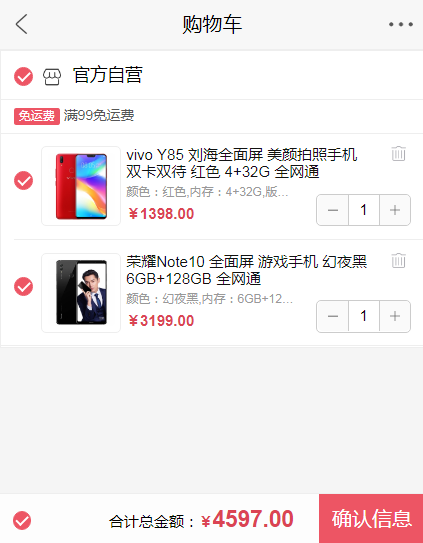

## 项目名称：
	爱购商城

## 技术架构：
	webpack + vue +vue-cli + vue-router + axios + less

## 项目启动：
	
	模块安装命令：npm install
	项目启动命令：yarn serve

## 项目结构：
	参考项目源码

## 项目描述：
	1、首页多个模块样式类似，组装了一个组件，父子间传值
	2、首页点击图片将数据带到详情页，vuex状态管理，将数据存储到store
	3、详情页点击“加入购物车”将数据传到购物车，购物车图标数字随之改变
	4、购物车页面主要实现：①单选商品②全选商品③加减键数字和价格变化④前三条点击变化时单个商品总价格和全部总价都随之改变⑤删除按钮删除对应商品
	5、订单页由购物车确认按钮将选中的商品数据带过来
	6、$router.go(-1)实现返回上一页

## 模块划分及项目展示：

*****

<table>
	<tr>
		<td>模块划分</td>
		<td>登录</td>
		<td>我的</td>
		<td>首页</td>
		<td>列表</td>
		<td>详情</td>
		<td>下单</td>
		<td>购物车</td>
	</tr>
	<tr>
		<td>路由</td>
		<td>/login</td>
		<td>/me</td>
		<td>/home</td>
		<td>/list</td>
		<td>/detail/id</td>
		<td>/order</td>
		<td>/shoppingcar</td>
	</tr>
	<tr>
		<td>效果图</td>
		<td></td>
		<td></td>
		<td></td>
		<td></td>
		<td></td>
		<td></td>
		<td></td>
	</tr>
</table>

*****

